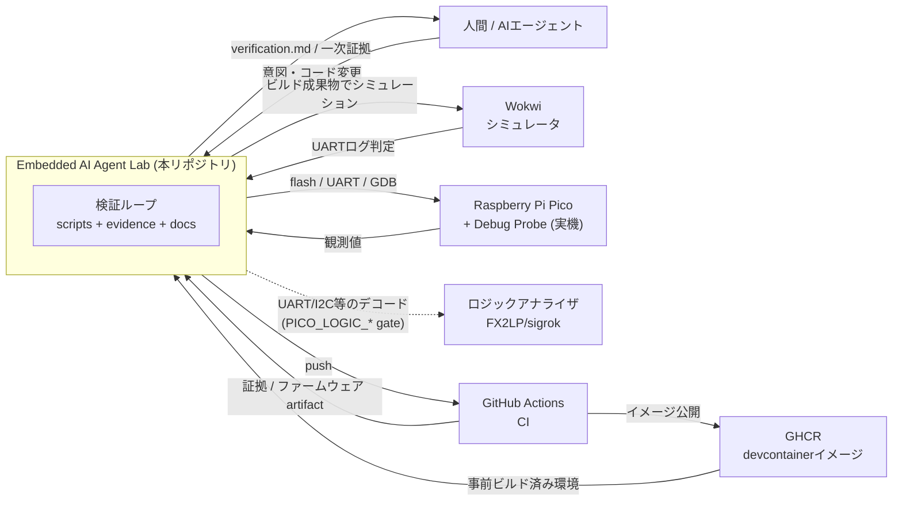

# 01. システムコンテキスト (C4: System Context)

このラボを**一番外側のズーム**で見た図です。「誰が使い、どの外部システムと関わるか」だけを示し、
内部構造には踏み込みません。まずここで全体の輪郭を掴みます。

## 読み方

- **中心(ラボ)** は、AIや人間が出した「コード変更」を受け取り、**証拠(verification.md と一次ログ/JSON)**を返す存在です。
- 外部システムは大きく3系統:**シミュレーション**(Wokwi)、**実機観測**(Pico+Debug Probe、ロジックアナライザ)、**CI/配布**(GitHub Actions と GHCR)。
- 実機とロジックアナライザへの経路は、安全ゲート(`PICO_HARDWARE` / `PICO_LOGIC_UART` / `PICO_LOGIC_I2C` / `PICO_LOGIC_ANALYZER`)が無い限り起動しません。詳細は [04_verification_flow.md](04_verification_flow.md)。

## Source of Truth

- 全体方針: [../../README.md](../../README.md), [../../SYSTEM_DESIGN.md](../../SYSTEM_DESIGN.md)
- CI/イメージ: [../../.github/workflows/ci.yml](../../.github/workflows/ci.yml), [../../.github/workflows/devcontainer-image.yml](../../.github/workflows/devcontainer-image.yml)
