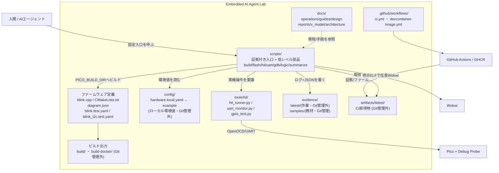

# 02. コンテナ図 (C4: Container)

ラボの**一段内側**です。リポジトリを構成する主要な「箱」(コンテナ=独立して動く/管理される単位)と、
その間のデータの流れを示します。ファイル単位ではなく、役割のまとまりで見ます。

## 読み方

- **`scripts/` が標準操作入口**です。AIも人間もここを通し、任意シェル実行はしません(設計方針: [../design/MCP_SETUP.md](../design/MCP_SETUP.md))。証拠付き入口(`build.sh`, `verify_all.sh`, 実機/観測wrapper)がログ+JSONを生成し、低レベル部品(`build_firmware.sh`, `test_ctest.sh`, `test_wokwi.sh`)は呼び出し元が証拠化します。
- **証拠は2系統**: 実行のたびに生まれる `evidence/latest/`(使い捨て)と、教材用に残す `evidence/samples/`(Git管理、来歴つき)。
- **設定の外出し**: ローカル依存値(UARTポート等)は `config/hardware.local.yaml` か環境変数。コードには直書きしません。
- **ビルド出力の分離**: ホスト直ビルドは `build/`、Docker経由は `build-docker/`(`PICO_BUILD_DIR` で切替)。Wokwi/実機系は共通ヘルパーで対象ELFを解決し、衝突回避のため別ディレクトリを維持します。詳細は [06_deployment.md](06_deployment.md)。

## Source of Truth

- 構成の一覧: [../../SYSTEM_DESIGN.md](../../SYSTEM_DESIGN.md)
- 証拠ポリシー: [../operations/TEST_EVIDENCE_POLICY.md](../operations/TEST_EVIDENCE_POLICY.md)
- `scripts/` の内部は [03_components_scripts.md](03_components_scripts.md) へ
