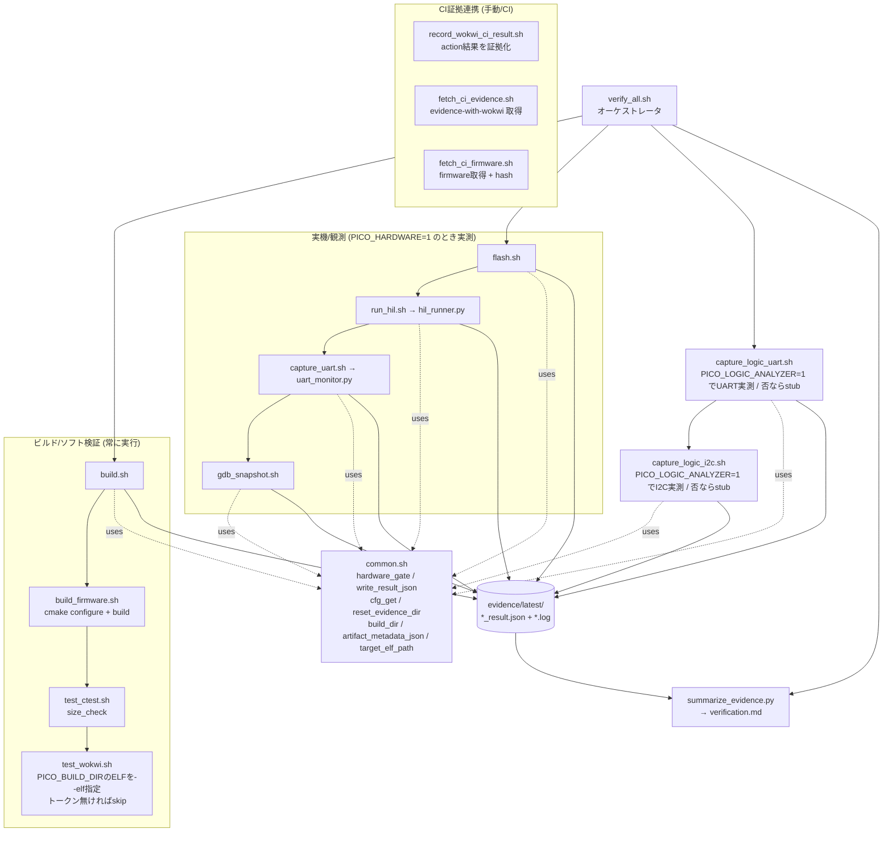

# 03. コンポーネント図 (C4: Component — `scripts/`)

最も内側のズームで、**`scripts/` の中身**を分解します。この基盤の心臓部であり、
各入口がどう連なり、共通ヘルパーと証拠ストアにどう依存するかを示します。

## 読み方

- **`verify_all.sh` が全体の指揮者**。`build.sh` が失敗したら実機ステップは試行せず要約だけ生成します(古いELFを焼かないため)。
- **`common.sh` が証拠付き入口の土台**。安全ゲート(`hardware_gate`)、結果JSONの書き出し(`write_result_json`)、設定読み込み(`cfg_get`)、証拠掃除(`reset_evidence_dir`)、ビルド成果物解決(`build_dir` / `target_elf_path`)、成果物ハッシュ(`artifact_metadata_json`)を提供します。
- **証拠付き入口は `evidence/latest/` に「ログ+結果JSON」を残し**、`summarize_evidence.py` がそれを集約して `verification.md` を作ります。低レベル部品(`build_firmware.sh`, `test_ctest.sh`, `test_wokwi.sh`)を直接実行した場合は、呼び出し元による証拠化は行われません。
- **CI証拠連携の3本**は通常ループの外側で、CIが生成した証拠/ファームウェアを取得・記録するためのものです。

## 注意(実装の現状メモ)

- UART読み取りは `uart_monitor.py`(`capture_uart.sh` 用)と `hil_runner.py` 内 `UARTMonitor`(`run_hil.sh` 用)の**2実装**があり、内容が分岐しています。共通化が望ましい箇所です。
- `gpio_test.py` は手動/調査用で、この自動ループからは呼ばれません。

## Source of Truth

- 各スクリプト本体: [../../scripts/](../../scripts/)
- 実機ツール本体: [../../tools/hil/](../../tools/hil/)
- 動きの時系列は [04_verification_flow.md](04_verification_flow.md) へ
