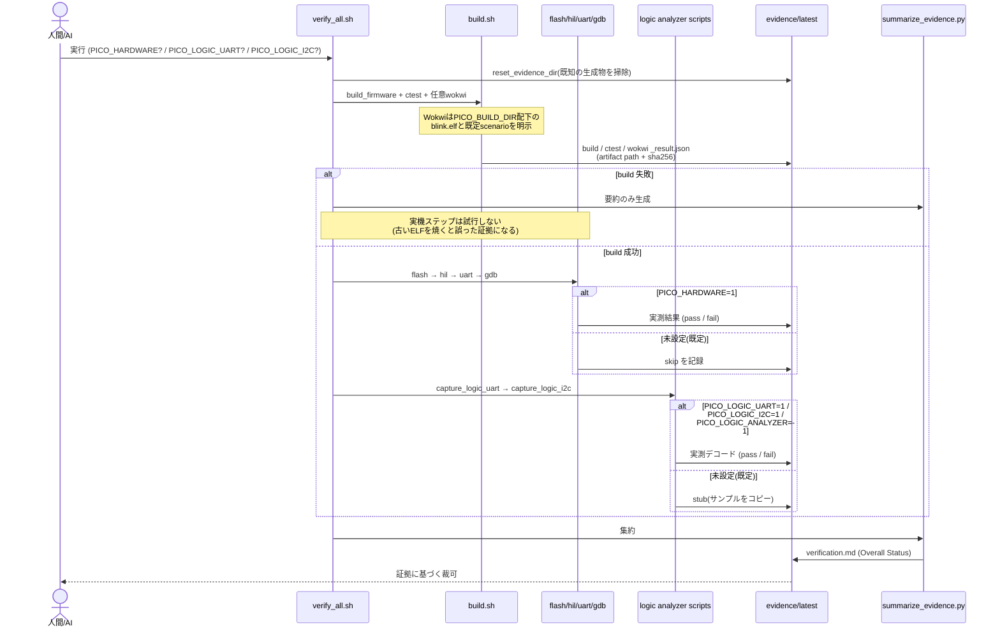

# 04. 検証フロー (UML: シーケンス図)

`verify_all.sh` を1回実行したとき、**時間に沿って何が起きるか**を示します。
安全ゲートによる分岐(実機を触る/触らない)が、この基盤の核心です。

## 読み方

- **既定(ゲート未設定)では、ハードウェアには一切触れません**。flash/hil/uart/gdb は `skip`、ロジックアナライザは `stub` を**証拠として**記録します。これらは「成功」ではありません。
- `PICO_HARDWARE=1` を**人間が明示的に**付けたときだけ実機を操作します。AIがこのゲートを勝手に有効化・回避することは禁止です([../operations/AGENT_OPERATION.md](../operations/AGENT_OPERATION.md))。
- ロジックアナライザは `PICO_LOGIC_UART=1` / `PICO_LOGIC_I2C=1` で個別に実測します。`PICO_LOGIC_ANALYZER=1` は全captureを有効化する互換スイッチです。
- **ビルド失敗は早期打ち切り**。古いファームウェアを焼いて「動いているように見える」誤証拠を避ける設計です。
- **Wokwiは対象ELFとscenarioを明示**します。Docker経路では `build-docker/blink.elf`、ホスト経路では `build/blink.elf` を使い、既定では `blink_i2c.test.yaml` でI2Cスキャン + UARTログを検証します。`*_result.json` の `artifacts` でパスとhashを確認できます。
- 最終的な裁可は `verification.md` の要約ではなく、**一次証拠(`*_result.json` と各ログ)**に基づいて行います。

## 判定の決まり方

各ステップの status(pass/fail/skip/stub)から Overall がどう決まるかは
[05_evidence_states.md](05_evidence_states.md) を参照してください。

## Source of Truth

- 実行順: [../../scripts/verify_all.sh](../../scripts/verify_all.sh)
- ゲート実装: [../../scripts/common.sh](../../scripts/common.sh) の `hardware_gate` / `logic_capture_enabled`
