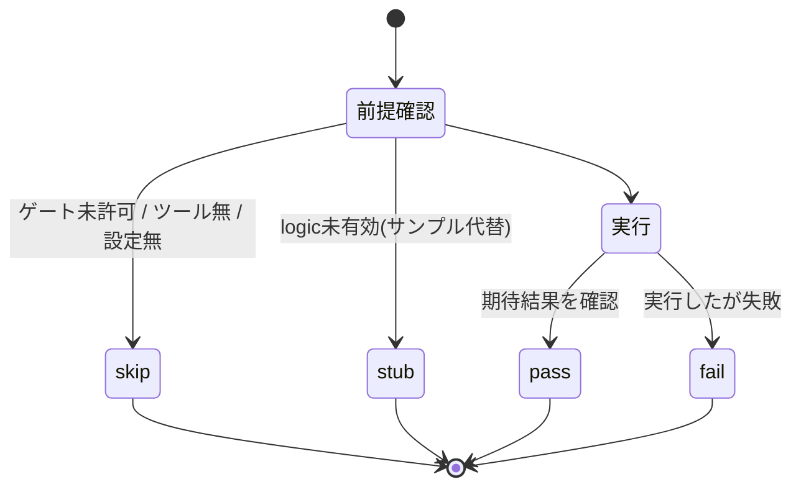
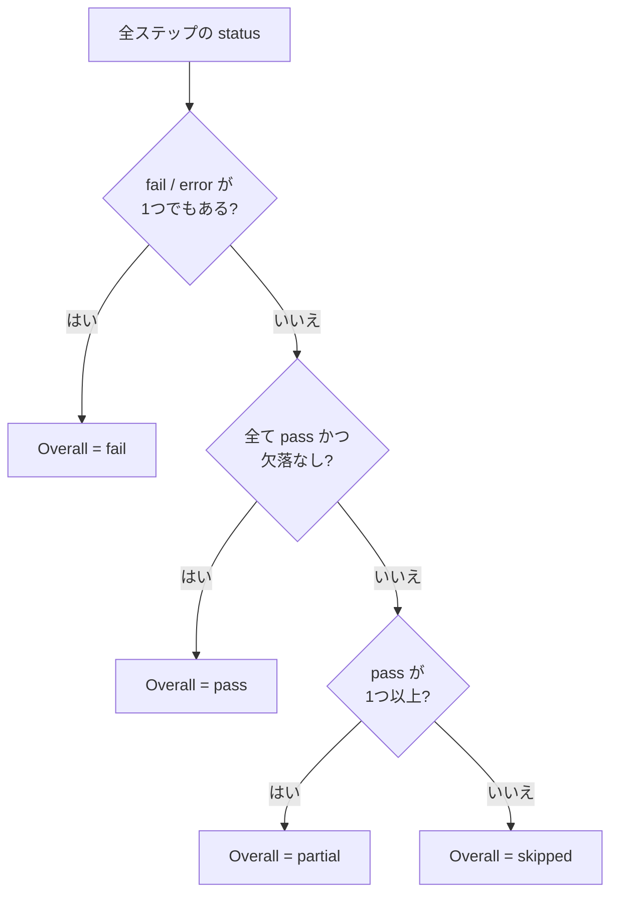

# 05. 証拠ステータスのモデル (UML: ステートマシン図)

この基盤の判定の心臓部です。**「証拠なしに成功と言わない」**という原則を、
ステータスという形式で表現しています。まず各ステップが取りうる状態、次に全体判定の決め方を示します。

## 各ステップの状態

- `pass` — 実際に実行され、期待結果が確認された
- `fail` — 実際に実行され、失敗した(ログに理由が残る)
- `skip` — **未実行**。前提(実機・ツール・`PICO_HARDWARE=1` 等)が無い
- `stub` — サンプル/代替データによる仮実行。**実測値ではない**

> `skip` と `stub` は成功ではありません。報告時に「成功」と言い換えてはいけません。

## 全体判定 (Overall) の決め方

実機ゲート未設定の通常ローカル実行では、Build/CTest が `pass`、実機系が `skip`、
ロジックアナライザが `stub` になるため、Overall は通常 **`partial`** になります。
これは正常で、「ソフト側は通ったが実機未実行」を正直に表しています。

## 発展: 静的な図と「生きた状態」

この図は判定**モデル**の静的な説明です。**今この瞬間の実状態**を知るには、図ではなく
`summarize_evidence.py` が生成する `evidence/latest/verification.md`(Git管理外の生成物)を読みます。
将来、`evidence/latest/*.json` の status を読んでこの図のノードを色分けする
「生きた図」を併設すると、証拠駆動という思想を図そのもので体現できます(任意の発展課題)。

## Source of Truth

- ステータス定義と全体判定ルール: [../operations/TEST_EVIDENCE_POLICY.md](../operations/TEST_EVIDENCE_POLICY.md)
- 判定の実装: [../../scripts/summarize_evidence.py](../../scripts/summarize_evidence.py) の `overall_status`
