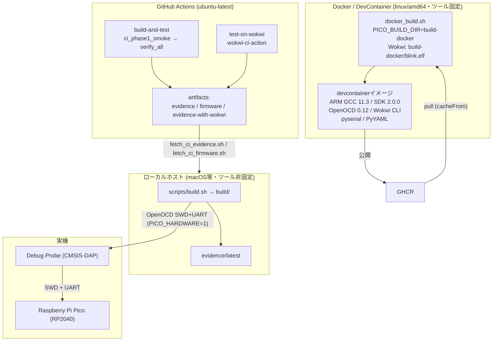

# 06. デプロイ図 (Deployment)

同じ `scripts/` 入口が**どの環境で動き、証拠がどこへ流れるか**を示します。
この基盤の再現性(ローカル/Docker/CIで同じ入口を使う)を理解する図です。

## 読み方

- **同じ `scripts/` 入口を3環境で共有**します。Docker/DevContainer は `linux/amd64` イメージで固定し、CIは同等ツールチェーンをGitHub Actions runner上にセットアップします。ローカル直ビルドは非固定なので証拠で差分を確認します。
- **ビルド出力は環境ごとに分離**: ローカルは `build/`、Docker経由は `build-docker/`(`PICO_BUILD_DIR` で切替)。ホストの `build/CMakeCache.txt` とコンテナ内パスの衝突を避けます。Docker内Wokwiは `build-docker/blink.elf` を明示して実行します。
- **再現性の比較は payload(`blink.uf2` / `blink.bin`)の hash** で行います。`build_result.json` に sha256 が記録され、ビルド日付は `CMakeLists.txt` で固定済み。比較対象は「Docker相当環境 ⇔ CI」であり、**ホスト直ビルドの `build/` は基準にしません**(ツール差で hash が変わるため)。
- **CIは2ジョブ**: `build-and-test`(実機なし、ゲートが skip/stub になることを `ci_phase1_smoke.sh` が表明。smoke内Wokwiは既定でtokenを抑制)と `test-on-wokwi`(Wokwiシミュレーション)。生成物は `fetch_ci_*.sh` で `artifacts/latest/` に取得します。

## Source of Truth

- CI: [../../.github/workflows/ci.yml](../../.github/workflows/ci.yml)
- イメージ公開: [../../.github/workflows/devcontainer-image.yml](../../.github/workflows/devcontainer-image.yml)
- Docker実行: [../../docker_build.sh](../../docker_build.sh) / [../../.devcontainer/Dockerfile](../../.devcontainer/Dockerfile)
- 環境構成の詳細: [../guides/SETUP_GUIDE.md](../guides/SETUP_GUIDE.md), [../v_model_environment/03_configuration_specification.md](../v_model_environment/03_configuration_specification.md)
